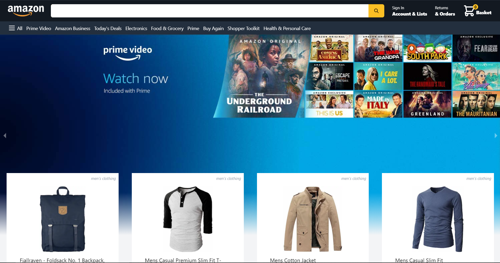

## Amazon Clone

Tailwind CSS + Next.js + Redux

Live Website: 

Image:



## Features

The features include:

* 📝 Full E-Commerce application.
* 📡 Realtime database in Firebase.
* 📦 Fully responsive
* 💬 Stripe payment method
* 📡 Hosted on Vercel.

<!-- ## Components -->

## Usage

To run the application locally; clone the repo, install dependencies and run the app.

```
$ git clone https://github.com/Conqueror14M/Amazon-Clone.git
$ cd amazon-clone
$ yarn && yarn run dev
```
or

```
$ npm && npm run dev
```

The app starts in development mode and opens a browser window on `http://localhost:3000`. The project rebuilds and the browser reloads automatically when source files are changed. Any build or runtime errors are propagated and displayed in the browser.
